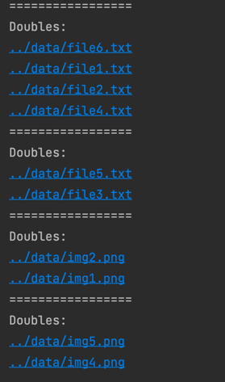

# Doubles

## Description

Script can find doubles files by content in directory

## Ruby compatibility

Developed on Ruby version 3.0.0

## Supported Features
* Find doubles among files. He don't matter what a content in a file.
* Easy start

## Usage

Just run `ruby main.rb` and result will be show in console

## Result

